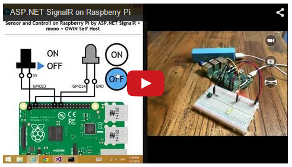
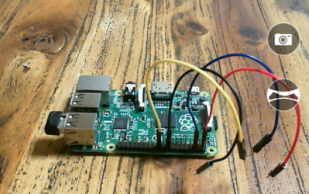
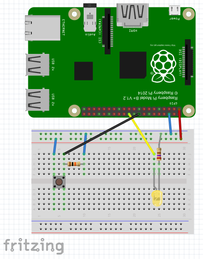

What's this? / これは何か?
======================

This is  the sample code of ASP.NET SignalR OWIN Self Hosting console app which can run on Raspberry Pi.

これは、Raspberry Pi 上でも実行可能な、OWIN セルフホスティングによる ASP.NET SignalR コンソールアプリのサンプルコードです。

Demonstration Video / デモ動画
---------------------------------
[ ](http://youtu.be/NHVvPBlqMmE)

Quick Start / 試してみよう
---------------------
1. Get a "Raspberry Pi" (and if you prefer, get a Wireless Network USB adapter)  
"Raspberry Pi"を購入します (お好みで、無線LANのUSBドングルも購入します)  
 
2. Install OS "Raspbian" and configure internet connection.  
OS "Raspbian" をインストールし、インターネット接続を構成します。
3. Wire up the logic taht is follow diagram on the solderless breadboard  
下図の回路をブレッドボード上に配線します。  
  
(Download "[SignalR-on-RaspPi.fzz](http://fritzing.org/media/fritzing-repo/projects/s/signalr-on-rasppi-sample-board/fritzing/SignalR-on-RaspPi.fzz)")
4. Enter following commands on shell of the Raspberry Pi.  
下記のコマンドを Raspberry Pi のシェルに入力します。  
```
$ sudo apt-get update  
$ sudo apt-get upgrade  
$ sudo apt-get install mono-complete
$ cd ~
$ mkdir myapp
$ cd myapp
$ curl -L http://j.mp/1yvqM1o > myapp.zip
$ unzip myapp.zip
$ sudo mono myapp.exe
```

At last, open the URL "http://*{IP Address of Raspberry Pi}*" by any modern web browsers on the PC that you prefer, or any modern SmartPhones.  
お好みのPC上の近代的Webブラウザ、または近代的なスマートフォーンで、URL  "http://*{Raspberry Pi の IP アドレス}*"を開きます。

How to build? / ビルド方法
===========================

Requirements / 要件
---------------------
- Windows OS
- Visual Studio 2013

> (*) It may can build other OS/build tools, also only command line tools, but I don't have tried it.  
> ※ 他のOS/ビルドツール、コマンドラインツールのみでもビルド可能かと思いますが、自分は試していません。

Steps / 手順
----------------

Enter follow commands in command prompt.

コマンドプロンプトで、以下のコマンドを実行します。

```
> git clone git@github.com:sample-by-jsakamoto/SignalR-on-RaspberryPi.git
> cd SignalR-on-RaspberryPi
> start SignalR-on-RaspPi.sln
```

Then Visual Studio is lauched, type ```Ctrl + Shift + B``` key.  
After that, you get out put files at myapp/bin/debug folder.

Visual Studio が起動するので、```Ctrl + Shift + B``` キーを押します。  
そうすると、myapp/bin/debug フォルダに出力ファイルが得られます。

How to deploy to Raspberry pi? / Raspberry pi への配置方法
===========================

Steps / 手順
----------------
Transfer all out put files to Raspberry pi.

すべての出力ファイルを Raspberry pi に転送します。

**Example/例**
```
> cd myapp/bin/debug
> scp -r * pi@<IP address of RaspPi>:/home/pi/
```

> (*) Tips - you can ran scp command and ssh command if you installed git for windows. These commands will be on ```C:\Program Files (x86)\Gin\bin``` folder.  
> ※Tips - git for Windows をインストール済みなら、scp コマンドや ssh コマンドを使えます。それらのコマンドは、```C:\Program Files (x86)\Gin\bin``` フォルダにあることでしょう。

Next, at the console of on Raspberry pi, enter follow commands.

次に、Raspberry pi のコンソール上で、以下のコマンドを入力します。

```
$ cd /home/pi
$ sudo mono myapp.exe
```

After that, you can access ```http://<IP address of Raspberry pi>/``` with any modern web browsers.

以上で、任意のモダン Web ブラウザで ```http://<Raspberry piのIPアドレス>/index.html``` にアクセスすることが可能です。
